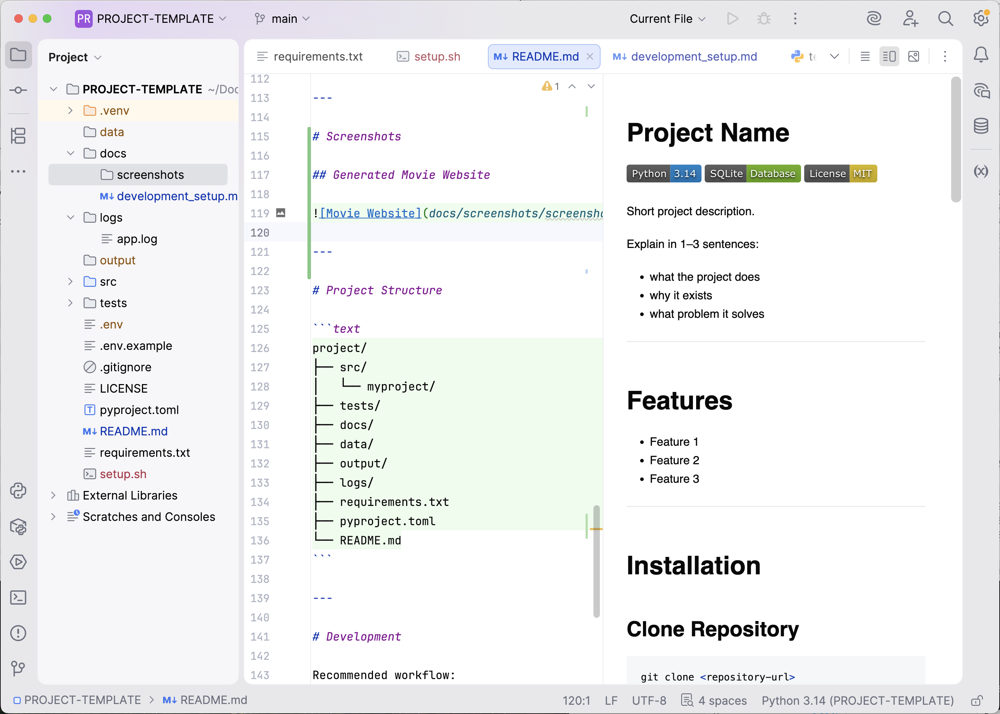

# OBO Pilot


AI-powered platform for creating and implementing a complete online marketing system, from brand positioning to traffic generation.

**What the Project Does**

OBO Pilot uses specialized AI assistants to guide users through a structured marketing process. It helps generate positioning statements, marketing strategies, website content, email campaigns, and advertising concepts while storing and organizing all project data in one place.

**Why It Exists**

Many entrepreneurs understand the importance of marketing but struggle to develop a clear, structured approach and turn ideas into action. OBO Pilot bridges the gap between marketing strategy and practical implementation by providing AI-guided support at every stage.

**What Problem It Solves**

Most small business owners and self-employed professionals lack the time, expertise, or resources to build a complete marketing system on their own. OBO Pilot simplifies this process by combining proven marketing frameworks with AI-powered guidance, helping users move from concept to execution faster and more efficiently.

---

# Features

- Feature 1
- Feature 2
- Feature 3

---

# Installation

## Clone Repository

```bash
git clone <repository-url>
cd <project-folder>
```

---

## Create Virtual Environment

### macOS / Linux

```bash
python -m venv .venv
source .venv/bin/activate
```

### Windows

```bash
python -m venv .venv
.venv\Scripts\activate
```

---

## Install Project

```bash
pip install -e .
```

---

## Install Dependencies

```bash
pip install -r requirements.txt
```

---

# Usage

Run the application:

```bash
python src/myproject/main.py
```

Example output:

```text
Application started
```

---

# Tests

Run tests with:

```bash
pytest
```

Run a specific test file:

```bash
pytest tests/test_main.py
```

---

# Environment Variables

Create a local `.env` file based on `env.example`.

Example:

```env
API_KEY=your_api_key_here
DEBUG=true
```

---

# Screenshots

## Generated Website



---

# Project Structure

```text
project/
├── README.md
├── cli/
├── data/
├── docs/
├── logs/
├── output/
├── src/
│   └── obopilot/
└── tests/
```

---

# Development

Recommended workflow:

1. Activate virtual environment
2. Install project in editable mode
3. Run tests regularly
4. Keep dependencies updated

---
